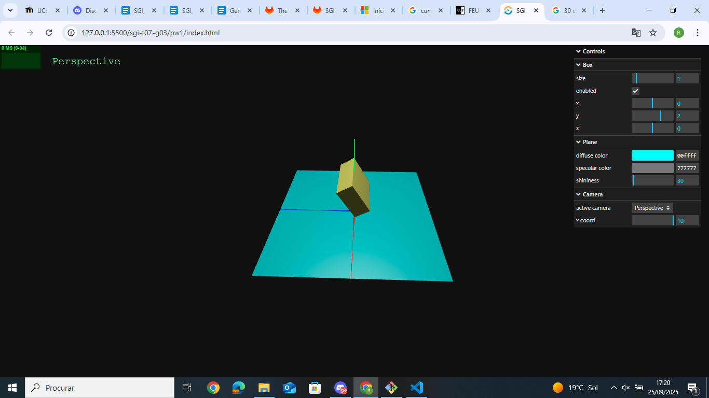
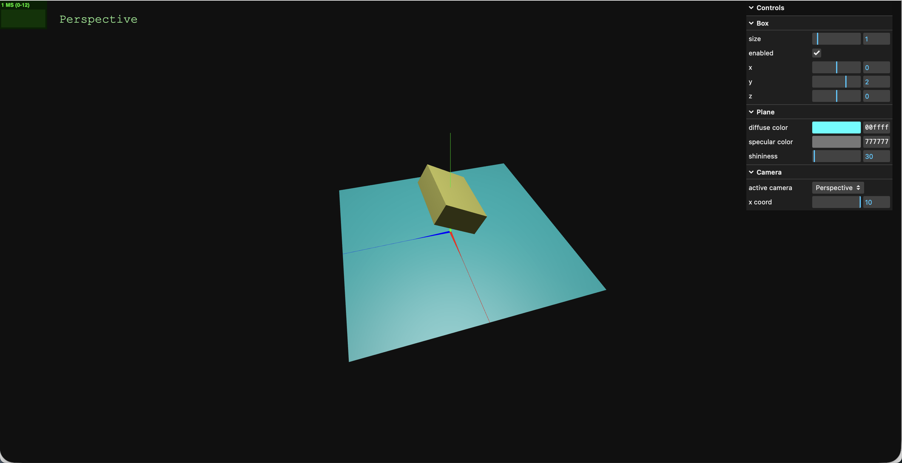

# SGI 2025/2026 - PW1

### Moodle Task - PW1-A
- We did not observe any differences.

### Moodle Task - PW1-B
- Setting the rotation property (using .rotation) sets the absolute rotation of the object, so however many times you set the property, only the last call applies. However, the rotateX() function is cumulative, so when you use it you don't _set_ the object's rotation, but rather increment it.

- In WebCGF the second approach is used in the rotate() function, which multiplies the rotation matrix by the current transformation matrix.

